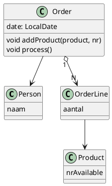

# Shop

De shop heeft een eenvoudig Orderline gebaseerd domein-model.

Het beheren van orders dient via de Order class te gebeuren.

De process methode() past de hoeveelheid beschikbare producten op Product aan.