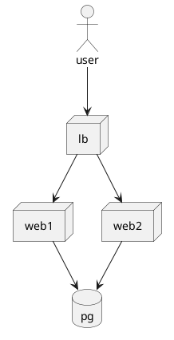

# Sprint 1

## Drivers

### Design Purpose

We maken dit ontwerp, en nemen dus die adrs, om een demo te maken die midden in een les gegeven moet kunnen worden.
Het is een beetje meta dus. Want het ontwerp op zich is ook weer een demo.

### Quality Attributes

Onderhoudbaarheid/analyseerbaarheid, oftewel duidelijkheid van de code is met afstand het belangrijkste.

*Let op* Vanwege het Design Purpose zitten de standaard redenen voor een gedistribueerd systeem hier niet in.
Normaal gesproken zet je een loadbalancer in voor bijvoorbeeld meer reliability, maar nu dus niet.

### Primary Functionality

Er moet een voorbeeld van 'gedistribueerde ellende' in zitten: oftewel code die prima werkt op 1 computer, maar ineens 
kapot gaat op meerdere.

### Concerns

Een zorgenpunt is dat Docker erg nukkig is als je zowel op Windows als op Mac/Linux ontwikkelt.
Gedoe met line-endings en dergelijke. Er is geen 'makkelijke' testopzet om dit effciënt te testen, dus 
hier zit een zekere mate van 'hopen dat het gaat werken'.

### Constraints

De demo moet uitchecken + werken (zonder gedoe) op Windows, Linux en Mac.

